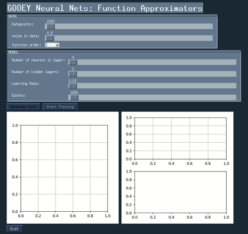

# GOOEY-Neural-Nets: Function Approximator




### Dependancies 

* PySimpleGUI
* pytorch (see installation instructions here(https://pytorch.org/get-started/locally/)) 
* numpy
* matplotlib

### Instructions 
```
pip install numpy
pip install matplotlib
pip install PySimpleGUI
```
* then install pytorch see installation instructions above

```
git clone https://github.com/ozayr/GOOEY-Neural-Nets/tree/master/function_approximator.git
cd function_approximator
python function_approximator.py
```

note: check logistic_regression.ipynb
